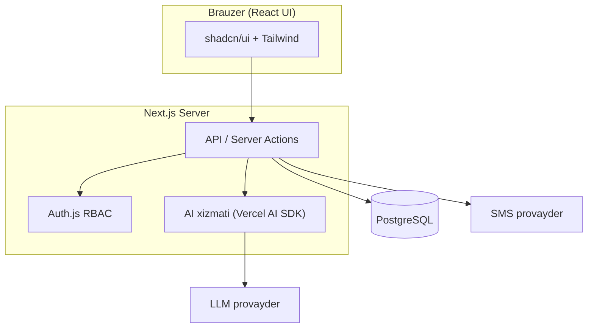

# Texnik Topshiriq (TZ) v1.0 — 2-qism: AI, arxitektura, ma'lumotlar modeli, roadmap

> Notion'dagi TZ hujjatining to'liq nusxasi (4–11-bo'limlar).
> 1–3-bo'limlar: `docs/tz/01-umumiy-va-funksional.md`.

---

# 4. Test moduli va AI spetsifikatsiyasi

> 🤖 **Muhim eslatma:** AI provayderi (eng kuchlisi tanlanadi) **keyinchalik
> ulanadi**. Kod provayderdan mustaqil (provider-agnostic) yoziladi —
> **Vercel AI SDK** orqali. Shu sababli API kaliti bo'lmasa ham tizim to'liq
> ishlaydi, AI modullari esa "ulanmagan" holatda turadi va kalit qo'yilishi
> bilan ishga tushadi.

## 4.1. Testlarni qo'shish (qo'lda va fayl orqali)

O'qituvchi tayyor testlarini tizimga uch usulda kirita oladi:

- **Qo'lda (forma orqali):** savol va javoblarni bittalab kiritadi, to'g'ri
  javob(lar)ni belgilaydi.
- **Matn joylashtirib (paste):** standart formatdagi matnni bir maydonga qo'yadi.
- **Fayl orqali:** `.txt` yoki `.docx` (Word) fayl yuklaydi; tizim faylni o'qib,
  savollarni avtomatik ajratadi (docx uchun matn ekstraksiyasi qilinadi).

### Fayl / matn strukturasi standarti

Belgilar sodda va aniq — o'qituvchi adashmasligi uchun:

| Belgi | Ma'nosi |
| --- | --- |
| `?` | Savol boshlanishi (savol matni oldida) |
| `+` | To'g'ri javob (bir nechta bo'lishi mumkin — ko'p javobli savol) |
| `-` | Noto'g'ri javob |
| (bo'sh qator) | Bir savolni ikkinchisidan ajratadi |

Namuna:

```text
? O'zbekiston poytaxti qaysi shahar?
+ Toshkent
- Samarqand
- Buxoro
- Xiva

? Suvning kimyoviy formulasi qanday?
- CO2
+ H2O
- O2
- NaCl
```

Qoidalar:

- Har bir savol `?` bilan boshlanadi, undan keyin javob variantlari keladi.
- Kamida bitta `+` (to'g'ri javob) bo'lishi shart.
- Savollar orasida bitta bo'sh qator qoldiriladi.
- Yuklashdan oldin tizim faylni tekshiradi (validatsiya): to'g'ri javobi yo'q
  yoki formati buzuq savolni aniq ko'rsatadi.
- Import qilingandan so'ng o'qituvchi testni ko'rib chiqadi, tahrirlaydi va
  saqlaydi.

## 4.2. Test o'tkazish va baholash

- Saqlangan test sinf yoki tanlangan o'quvchilarga tayinlanadi.
- O'quvchi testni yechadi; tizim avtomatik baholaydi (to'g'ri javoblar soni,
  foizi va bali).
- Har bir urinish natijasi saqlanadi: o'quvchi, test, ball, foiz, sana,
  sarflangan vaqt.

## 4.3. Test natijasiga qarab reyting

> 📊 Test natijalari asosida alohida **test reytingi** hosil qilinadi:
> o'quvchilar ballga qarab tartiblanadi va **1-2-3 o'rin** ajratib ko'rsatiladi
> (sinf va maktab miqyosida).

- Reyting turlari: bitta test bo'yicha, fan bo'yicha (o'rtacha), umumiy davr
  bo'yicha.
- Test reytingi choraklik umumiy reyting bilan birlashtirilishi mumkin (sozlanadi).
- Natijalar grafik va jadvalda ko'rsatiladi hamda eksport qilinadi.

## 4.4. AI test generatori (namunaga asoslangan)

O'qituvchi ikki xil usulda test so'raydi:

1. **Parametr bo'yicha:** fan, mavzu, sinf darajasi, qiyinlik, savollar soni va
   turi (test/ochiq savol) — AI test tuzadi.
2. **Namuna bo'yicha (asosiy talab):** o'qituvchi tayyor namuna testni
   kiritadi/joylaydi — AI **o'sha darajada va o'sha mavzuda** o'xshash yangi test
   tuzadi.

> 🎯 **Namunadan o'rganish mexanizmi (few-shot):** namunadagi savollar model
> kirishiga misol sifatida beriladi. AI namunaning qiyinlik darajasi, uslubi,
> mavzu doirasi va savol formatini tahlil qilib, xuddi shunga mos yangi savollar
> generatsiya qiladi. Natija tahrirlanadi va saqlanadi.

- Generatsiya natijasi: savollar + to'g'ri javoblar + (ixtiyoriy) izoh.
- O'qituvchi tahrirlaydi, saqlaydi, qayta ishlatadi.
- Ochiq javoblarni AI baholab bera oladi (kelgusi bosqich).

## 4.5. AI o'quvchi tahlili

- Kirish ma'lumoti: baholar, davomat, jarima ball, choraklik dinamika.
- Natija: kuchli/zaif fanlar, xulq-atvor tendensiyasi, tavsiyalar (o'qituvchi va
  ota-ona uchun tabiiy tilda).
- Til: foydalanuvchi tiliga mos (uz/ru/en).

## 4.6. AI yordamchi (ma'lumot bo'yicha savol-javob)

- Admin/o'qituvchi tabiiy tilda savol beradi (masalan: "9-A sinfda bu chorak eng
  past davomat kimda?").
- AI **ruxsat doirasidagi** ma'lumotga asoslanib javob beradi (RBAC hurmat
  qilinadi).

## 4.7. AI arxitektura tamoyillari

- Provider-agnostic (Vercel AI SDK): OpenAI / Anthropic / Gemini o'rtasida oson
  almashish.
- AI so'rovlari server tomonda (API kalit hech qachon brauzerga chiqmaydi).
- Xarajat nazorati: so'rov limitlari, keshlash, log.
- Xavfsizlik: AI ga faqat kerakli, anonimlashtirilishi mumkin bo'lgan ma'lumot
  beriladi.

---

# 5. Nofunksional talablar (NFR)

| Kategoriya | Talab |
| --- | --- |
| Ishlash tezligi | Asosiy sahifalar tez yuklanadi; ro'yxatlar sahifalanadi (pagination) va indekslanadi. |
| Xavfsizlik | Parol hashing, RBAC, HTTPS, kirish nazorati, audit jurnali, CSRF/XSS/SQL-injection himoyasi. |
| Kengayuvchanlik | Modulli arxitektura; yangi maktab/filial qo'shishga tayyor ma'lumotlar modeli. |
| Ishonchlilik | Ma'lumotlar bazasi zaxira nusxasi (backup), migratsiyalar versiyalangan. |
| Qulaylik (UX) | Sodda, tez ishlaydigan interfeys; mobil brauzerda moslashuvchan (responsive). |
| Maxfiylik | Voyaga yetmaganlar ma'lumoti himoyalanadi; minimal ma'lumot tamoyili. |
| Lokalizatsiya | 3 til, sana/valyuta formati (so'm) mahalliylashtiriladi. |

---

# 6. Texnik arxitektura

## 6.1. Texnologiyalar steki

| Qatlam | Texnologiya |
| --- | --- |
| Frontend + Backend | Next.js (App Router) + TypeScript |
| UI | Tailwind CSS + shadcn/ui |
| Ma'lumotlar bazasi | PostgreSQL + Prisma ORM |
| Autentifikatsiya | Auth.js (NextAuth) — login/parol + RBAC |
| Ko'p tillilik | next-intl (uz/ru/en) |
| AI | Vercel AI SDK (provider-agnostic) |
| SMS | Eskiz.uz / Play Mobile API |
| Deploy | Vercel yoki VPS (Docker), Managed PostgreSQL |

## 6.2. Yuqori darajali arxitektura



## 6.3. Loyiha tuzilishi (TZ dagi taxminiy reja)

```text
/app            -> sahifalar va API (App Router)
/components     -> UI komponentlar (shadcn/ui)
/lib            -> yordamchi funksiyalar, auth, db klient
/prisma         -> schema.prisma va migratsiyalar
/services       -> biznes-logika (davomat, baho, to'lov, AI, SMS)
/messages       -> i18n tarjimalar (uz.json, ru.json, en.json)
```

> ℹ️ **Amalda:** kod `src/` ostida joylashgan (`src/app`, `src/components`,
> `src/lib`), alohida `/services` papkasi yaratilmagan — biznes-logika
> `src/lib/*.ts` fayllarida. Haqiqiy tuzilish: `docs/01-loyiha-holati.md`.

---

# 7. Ma'lumotlar modeli (ERD)

```mermaid
erDiagram
	USER ||--o| TEACHER : "bog'lanadi"
	USER ||--o| GUARDIAN : "bog'lanadi"
	GUARDIAN ||--o{ STUDENT : "farzandi"
	CLASS ||--o{ STUDENT : "o'quvchilari"
	TEACHER ||--o{ CLASS : "rahbari"
	CLASS ||--o{ LESSON : "jadvali"
	SUBJECT ||--o{ LESSON : "fani"
	TEACHER ||--o{ LESSON : "o'qituvchisi"
	STUDENT ||--o{ ATTENDANCE : "davomati"
	LESSON ||--o{ ATTENDANCE : "darsi"
	STUDENT ||--o{ GRADE : "baholari"
	SUBJECT ||--o{ GRADE : "fani"
	QUARTER ||--o{ GRADE : "choragi"
	STUDENT ||--o{ PENALTY : "jarimalari"
	PENALTY_CRITERION ||--o{ PENALTY : "mezoni"
	STUDENT ||--o| CONTRACT : "kontrakti"
	CONTRACT ||--o{ INVOICE : "hisoblari"
	INVOICE ||--o{ PAYMENT : "to'lovlari"
	STUDENT ||--o{ MESSAGE : "xabarlari"
	TEACHER ||--o{ TEST : "testlari"
	TEST ||--o{ TEST_RESULT : "natijalari"
	STUDENT ||--o{ TEST_RESULT : "natijalari"
```

## 7.1. Asosiy entitilar (qisqacha)

| Entiti | Asosiy maydonlar |
| --- | --- |
| User | id, name, email/phone, passwordHash, role, locale, status |
| Student | id, firstName, lastName, dob, gender, photo, classId, guardianId, enrollDate, status |
| Teacher | id, userId, subjects, contact |
| Guardian (ota-ona) | id, userId, fullName, phone, relation |
| Class | id, name, grade, academicYear, homeroomTeacherId |
| Subject | id, name(uz/ru/en) |
| Lesson (jadval) | id, classId, subjectId, teacherId, dayOfWeek, startTime, endTime, room |
| Attendance | id, studentId, lessonId, date, status, note |
| Grade | id, studentId, subjectId, quarterId, value, type, date, teacherId |
| Quarter | id, academicYear, name(1-4), startDate, endDate |
| Penalty (jarima) | id, studentId, criterionId, points, note, issuedBy, date |
| PenaltyCriterion (mezon) | id, name, description, points, category, createdBy, active |
| Contract | id, studentId, monthlyAmount, discount, startDate, endDate |
| Invoice | id, contractId, period, amount, dueDate, status |
| Payment | id, invoiceId, amount, method, date, receivedBy |
| Message (SMS) | id, studentId, channel, body, status, sentAt |
| Test | id, teacherId, subjectId, source (manual/file/ai), topic, difficulty, questions(JSON), createdAt |
| TestResult (natija) | id, testId, studentId, score, percent, takenAt, durationSec |
| AuditLog | id, userId, action, entity, timestamp |

> ℹ️ Amaldagi to'liq va aniq sxema — `prisma/schema.prisma`. U TZ dagi butun
> modelni qamrab olgan (jumladan hali interfeysi yo'q jadvallar ham).

---

# 8. Ishlab chiqish bosqichlari (Roadmap)

> 🗺 Har bir bosqich mustaqil ishlaydigan, sinovdan o'tgan qism sifatida
> topshiriladi. Muddat qo'yilmaydi — ketma-ketlik va tayyorlik holatiga e'tibor
> beramiz.

1. **Poydevor** — loyiha sozlash (Next.js, Tailwind, shadcn, Prisma, DB, i18n skeleti).
2. **Auth va rollar** — 4 rol, login, RBAC, foydalanuvchi boshqaruvi.
3. **O'quvchi va o'qituvchi bazasi** — CRUD, profil, qabul, hamda **fayldan
   ommaviy import/eksport** (Excel/CSV — 3.14-bo'lim).
4. **Sinf/guruh va dars jadvali.**
5. **Davomat (yo'qlama).**
6. **Baholar + choraklik statistika + 1-2-3 reyting.**
7. **Jarima ball tizimi.**
8. **To'lovlar / kontraktlar (buxgalteriya).**
9. **Dashboard va hisobotlar.**
10. **SMS xabarnomalar.**
11. **Test moduli** — testlarni qo'lda va fayl (txt/docx) orqali qo'shish, test
    o'tkazish, avtomatik baholash va **test natijasi reytingi**.
12. **AI yadrosi** (Vercel AI SDK, provider-agnostic — kalit keyin).
13. **AI test generatori** (namunaga asoslangan).
14. **AI o'quvchi tahlili.**
15. **AI yordamchi (chat).**

> ✅ **Joriy holat:** 1–4-bosqich bajarilgan, **5-bosqich (davomat) navbatda**.
> Batafsil: `docs/01-loyiha-holati.md` va `docs/03-keyingi-ishlar.md`.

---

# 9. Qabul mezonlari (Definition of Done)

- [ ] Har bir modul o'z ruxsat matritsasiga mos ishlaydi.
- [ ] Asosiy amallar uchun avtomatik testlar mavjud.
- [ ] TypeScript typecheck va lint xatosiz.
- [ ] Interfeys 3 tilda ishlaydi.
- [ ] Ma'lumotlar bazasi migratsiyalari versiyalangan.
- [ ] Har bir yirik o'zgarish uchun tushuntiruvchi hujjat va draft PR.
- [ ] O'quvchi va o'qituvchini fayldan import qilish ishlaydi: shablon, oldindan
      ko'rish, xato hisoboti, audit yozuvi.

---

# 10. Xatarlar va taxminlar

| Xatar / taxmin | Yechim |
| --- | --- |
| AI provayder kaliti hozircha yo'q | Provider-agnostic kod; AI modullari kalit qo'yilgach ishga tushadi |
| SMS provayder tanlovi va byudjeti | Eskiz.uz / Play Mobile; abstraksiya orqali oson almashtiriladi |
| Baho tizimi (5 yoki 100 balli) | Sozlamalar orqali konfiguratsiya qilinadi |
| Ma'lumot maxfiyligi (voyaga yetmaganlar) | Qat'iy RBAC, audit, minimal ma'lumot |
| Bloklangan hisob sessiyasi darhol tugamaydi (30 daqiqagacha) | 3.1.1-bo'limdagi qaror: yozuv amallarida darhol tekshirish, kerak bo'lsa DB sessiya strategiyasi |

---

# 11. Kelajakdagi kengaytmalar

- Mobil ilova (React Native / PWA).
- Onlayn to'lov shlyuzi (Payme / Click).
- Video-dars va uy vazifasi moduli.
- Biometrik/QR davomat.
- Kutubxona va oshxona moduli.
